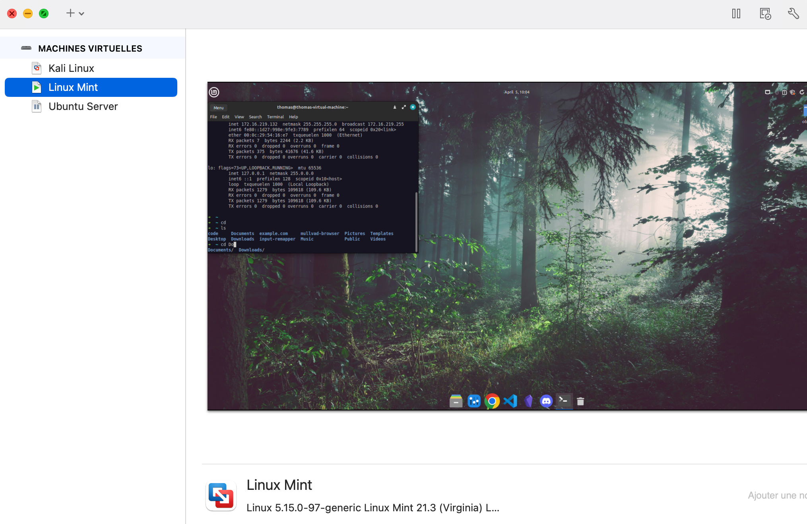
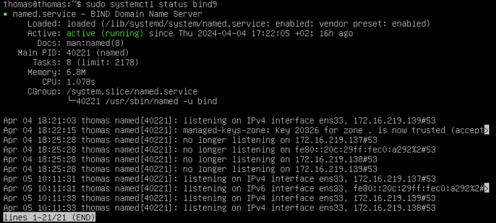
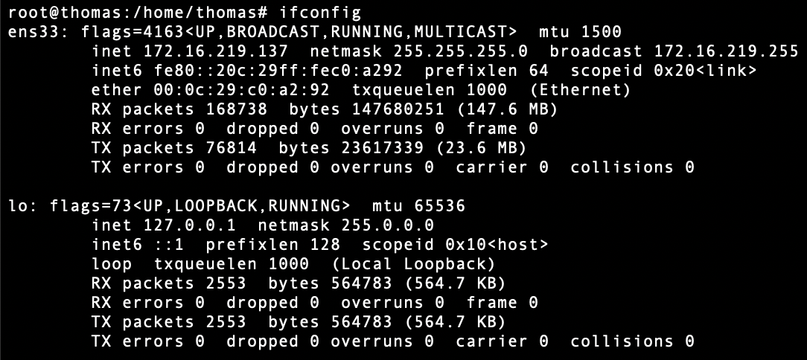
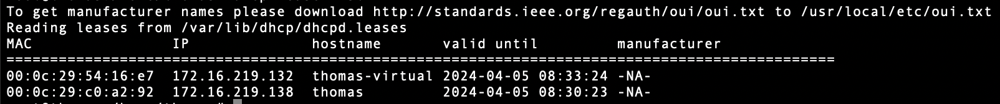
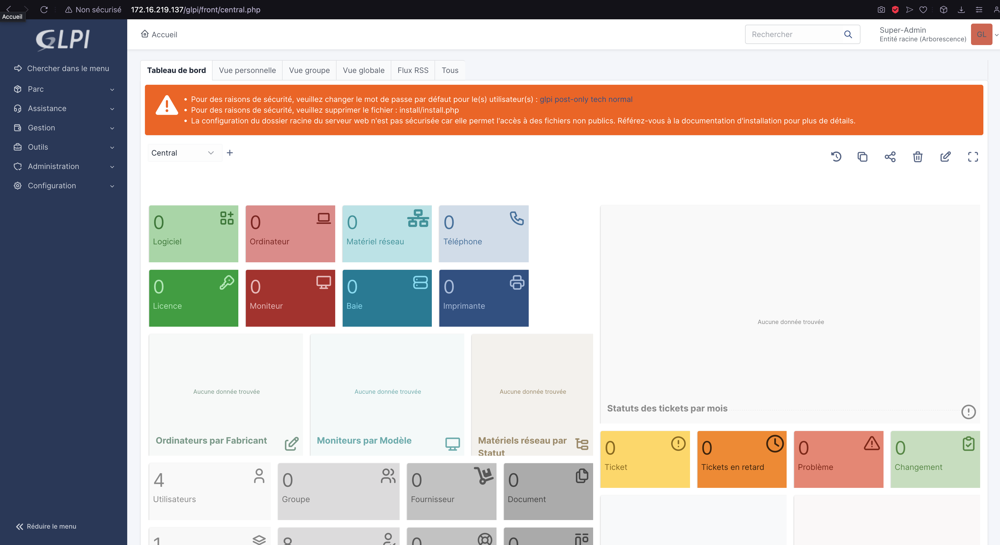
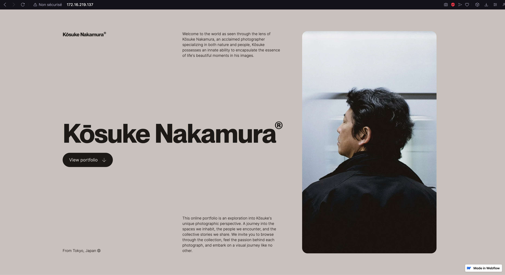
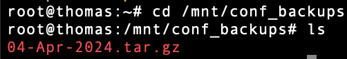

# Linux Server

Here's my readme for the Linux Server project.

<br>

## Client Request:

The local library in your little town has no funding for Windows licenses so the director is considering Linux. Some users are sceptical and ask for a demo. The local IT company where you work is taking up the project and you are in charge of setting up a server and a workstation.
To demonstrate this setup, you will use virtual machines and an internal virtual network (your DHCP must not interfere with the LAN).

You may propose any additional functionality you consider interesting.

<br>
<br>
<br>

# How I did it

I used Vmware Fusion to build my server and client.
The server is an Ubuntu Server and the client is a Linux Mint.

<br>

## Linux Client specs:

- Linux Mint 21.3 Cinnamon
- Intel I7-8700B
- 40 GB Storage
- Zsh shell
- Kernel 5.15.0-97-generic
- 4 CPU Cores
- 8 GB Ram

<br>

## Ubuntu Server specs

- 2 CPU Cores
- 4 GB Ram
- 40 GB storage
- Ubuntu server 22.04.4 LTS
- DHCP
- DNS
- HTTP server
- GLPI and mariadb

<br>
<br>



<br>
<br>

## Client build

I installed the latest stable version of Linux Mint via VMware Fusion. (iso)
Once in the Mint VM I did some customization, I'll skip the details since it's not the main focus.
Into bash we will update/upgrade apt package manager and set a root password and test it

```bash
   sudo apt update
   sudo apt upgrade
   sudo passwd root
   su root
```

I also had to install GIMP (LibreOffice already on Mint)

```bash
    sudo apt install gimp
```

Mullvad Browser installation:
```bash
    cd Downloads && tar xf mullvad-browser-linux64-13.0.13.tar.xf
    rm mullvad-browser-linux64-13.0.13.tar.xf
    mv mullvad-browser ~/ && cd ~/mullvad-browser && ./start-mullvad-browser-desktop --register-app
```

We can use ssh to the client in case of need of remote assistant or use a remote tool.


<br>

## Server build

Install the Ubuntu Server with the latest stable iso version.
Once in the server same as the clien, update/upgrade apt and access root user.

<br>
<br>

# DNS

I the started with the DNS server using BIND9.

```bash
   sudo apt install bind9
```

Need to do some little configuration:

```bash
    sudo nano /etc/bind/named.conf.options
```
and into the file add the two forwarders:
```bash
    forwarders {
        8.8.8.8; - Google DNS
        8.8.4.4.; - Cloudflare DNS
    };
```

We also need to enable it to make sure it runs.

```bash
    sudo systemctl restart bind9
    sudo systemctl enable bind9
```

<br>



<br>
<br>

# DHCP

Now let's do the DHCP

```bash
   sudo apt install isc-dhcp-server -y
```

We're gonna do some config now:

```bash
    sudo nano /etc/dhcp/dhcpd.conf
```

into the file:

```bash
    subnet 172.16.219.0 netmask 255.255.255.0 {
        range 172.16.219.101 172.16.219.200;
        option routers 172.16.219.1;
        option broadcast-address 172.16.219.255;
        option domain-name-servers 172.16.219.1;
    }
```

<br>

Here's the ifconfig:



<br>

So we can see on the screen I'm using the ens33 interface. We need to configure it in this file:

```bash
    sudo nano /etc/default/isc-dhcp-server
```

```bash
    INTERFACESv4="ens33"
```

Same as for DNS, enabling it:

```bash
   sudo systemctl restart isc-dhcp-server
   sudo systemctl enable isc-dhcp-server
```

We can check the list of attributed addresses with:

```bash
    dhcp-lease-list
```

<br>



<br>
<br>

# HTTP

To build the HTTP and GLPI I followed the tutorial on the GLPI official website By just replacing with our correct credentials and skipping the undesired parts.:
https://faq.teclib.com/03_knowledgebase/procedures/install_glpi/

<br>

What give us this when done with it:



<br>

I also set up a Firewall basic settings:

```bash
    sudo ufw allow 22,80,443,53
    sudo ufw enable
```

<br>

I added a html template I found online to replace the default apache index for fun:



<br>
<br>

# Backup

For the backup we're gonna use a bash script that create a directory based on the daily date, copy all the important config file in it and make a tar archive of it. ( do it as sudo 🙏 )

```bash
    cd && mkdir scripts && cd scripts && touch conf_backup.sh && vim conf_backup.sh
```

Into the file:

```bash
    sudo mkdir /tmp/$(date +%d-%b-%Y)
    sudo cp -r /etc/bind /etc/dhcp /etc/apache2 /etc/mysql /etc/php /etc/resolv.conf /tmp/$(date +%d-%b-%Y)/
    sudo tar -zcvf /mnt/conf_backups/$(date +%d-%b-%Y).tar.gz /tmp/$(date +%d-%b-%Y)/
    sudo rm -rf /tmp/$(date +%d-%b-%Y)
```

Now we are gonna do a cron to execute it:

```bash
    sudo crontab -u root -e
```

I'll do my cron at 1am on each saturday:
```bash
    00 01 * * 6 /root/scripts/conf_backup.sh
```

I first did a test to see if it's working:



<br>
<br>

And here we are that's bassicaly how I did my Client/Server.

🤠🤠🤠
